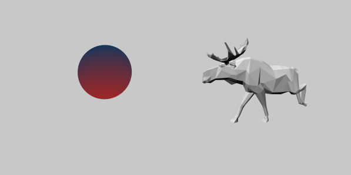
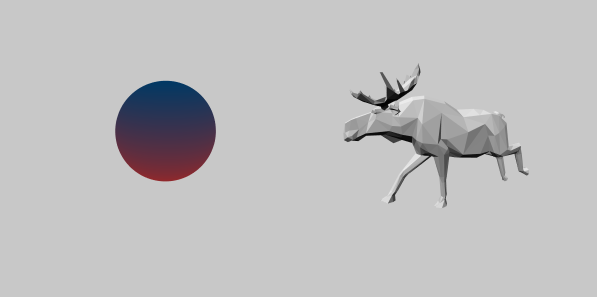

# three

> Nuxt.js project

## Build Setup

``` bash
# install dependencies
$ npm install # Or yarn install

# serve with hot reload at localhost:3000
$ npm run dev

# build for production and launch server
$ npm run build
$ npm start

# generate static project
$ npm run generate
```

For detailed explanation on how things work, checkout the [Nuxt.js docs](https://github.com/nuxt/nuxt.js).

## G3D ([官网](https://alibaba.github.io/G3D/))

>

### 1. 包管理器

- npm

  安装 node 环境, 默认安装

- yarn

  推荐使用 yarn 包管理器 ([下载地址](https://yarnpkg.com/en/docs/install))

### 2. 配置淘宝镜像

&emsp;由于国内网络环境的问题, 使用淘宝镜像能更有效的下载依赖的库

``` bash
$ npm config set registry https://registry.npm.taobao.org
$ yarn config set registry https://registry.npm.taobao.org
```

### 3. 使用

- 安装依赖包

  ``` bash
  $ yarn add g3d Or npm install g3d
  ```

- 引入依赖包

  ``` bash
  import G3D from 'g3d'
  ```

- 流程

    - 初始化 3D 引擎
      ```
      const engine = new G3D.Engine(canvas)
      ```

    - 创建场景
      ```
      const scene = new G3D.Scene(engine)
      ```

    - 创建摄像机
      ```
      const camera = new G3D.ArcRotateCamera(scene)
      camera.alpha = 45
      camera.beta = 30
      camera.radius = 12
      camera.fov = 60
      ```

    - 创建灯光 (光源)
      ```
      // 创建半球光源, 上部为蓝色, 下部为红色
      const light = new G3D.HemisphereLight(scene)
      Object.assign(light.sky, {r: 0, g: 144, b: 255})
      Object.assign(light.ground, {r: 200, g: 100, b: 100})
      ```

    - 创建网格
      ```
      // 创建一个红色的球体网格模型
      const ball = G3D.MeshBuilder.createSphere(scene, 2, 64, 64)
      Object.assign(ball.position, {x: 0, y: 0, z: 0})
      Object.assign(ball.materials.default.diffuseColor, {r: 200, g: 100, b: 100})
      Object.assign(ball.materials.default.specularColor, {r: 200, g: 100, b: 100})
      ball.materials.default.glossiness = 10
      ```

    - 渲染场景
      ```
      scene.render()
      ```

- [示例](./pages/index.vue)

&emsp;&emsp; 

&emsp;&emsp; 
